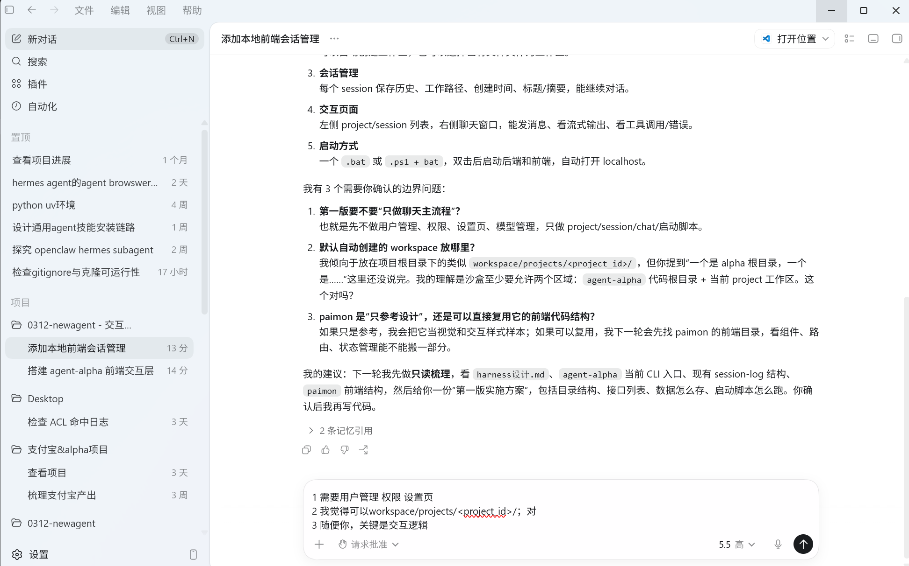
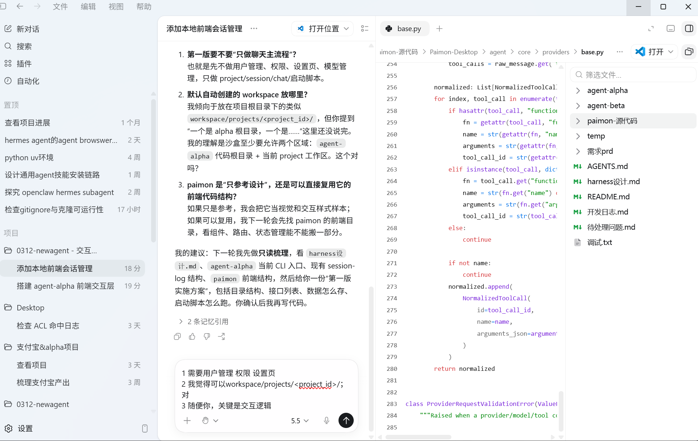

第一版前端界面
参考： 
页面区域：左侧是proect和project的对话session，中间是对话框，右侧是文件预览
左侧左上角有新对话 skill查看（查看安装了哪些skill和mcp） API接入
左侧中部/下部是proect，可以新建project，既可以默认alpha内的workspace/project区域，也可以指定文件夹

左上角的功能点击后就是会在中间弹出页面进行设置，然后有返回主页面的按钮可以关闭

右侧文件预览，按钮右上角，平时不展开，点击后展开；展开后能看到工作区的文件结构和文件，然后可以做个代码文件预览，md文档、txt预览，如果难做，比如要安装很重的依赖，那就可以不做，但是要和我说；其他文件类型如果简单可以顺手做了，打不开用户点击文件后就提示打不开，设计可以参考 